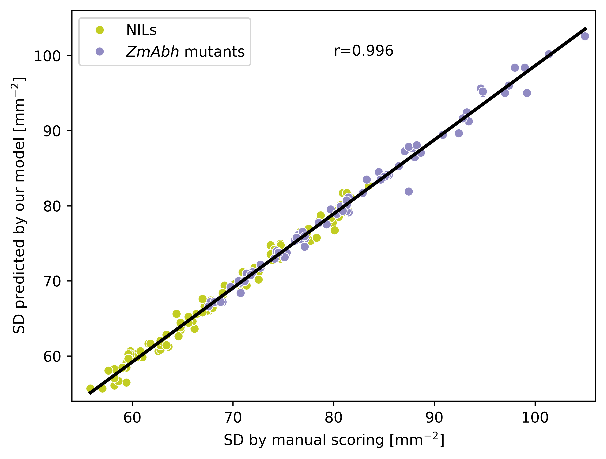
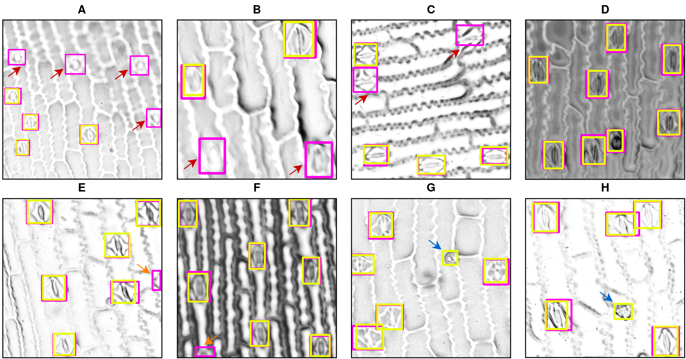

# StomaDet

[](https://www.python.org/downloads/release/python-3100/)
[](https://github.com/pytorch/pytorch/releases/tag/v2.1.0)
[](https://opensource.org/licenses/MIT)

This repository provides the source code of the StomaDetector in "Additive effects of stomata density and leaf ABA levels on maize water use efficiency". Here, we trained and evaluated a Faster-RCNN-based object detector to detect stomata in microscopy images of maize leaves. The predicted stomatal counts (and thus the calculated stomatal density) is highly correlated with manual counts with a r-value of 0.996.

<p align="center">
    
</p>
## Results on the Test-Set
Here we show the results of the best performing model. The mAP50 on a hold-out test-set was calculated at almost 99%, indicating good generalization.   

### Example Predictions
Here we show some example predictions from the hold-out test-set. The main difficulty for the model are images with severe out-of-focus blur, which might be rectified while image acquisition.
<p align="center">
    
</p>

## Installation Instructions
1. Clone this project
```
git clone git@github.com:grimmlab/StomaDet.git
```
2. Adjust Dockerfile, so the user matches your name and ID (`id -g` and `id -u`). That way, you will have the ownership of the files generated inside docker.
3. Install StomaDet
```
cd StomaDet
docker build -t stoma_det .
```
4. Download dataset from Mendeley Data (TODO: add link) and paste the unzipped files in `StomaDet/data`.
5. Start docker container
```
docker run -it -v /path/to/github/repo/StomaDet:/workspace --workdir /workspace --runtime nvidia --gpus device=0 --ipc=host --ulimit memlock=-1 --ulimit stack=67108864 --name stoma_det1 stoma_det
```

Note: For the installation of an easy way of inference through a web app, please follow the instructions [here](./StomaApp/Readme_StomaApp.md)

## Reproducibility

1. Image normalisation using mean and standard deviation of the training dataset
```
python3 calc_mean_std.py 
```
This will return the following results:
- mean=tensor([0.8020, 0.8020, 0.8020])
- std=tensor([0.1936, 0.1936, 0.1936])

which are the values used in the scripts `train_faster_rcnn.py` and `retrain_faster_rcnn.py`.

2. Dataset splits
```
python3 split_dataset.py 
```
This script will use the information in `StomaDet/data/dataset.csv` and create a stratified train-val-test split. Here, the split might vary due to the random number generator used in different machines, so we also made our split dataset files publicly available. They can be downloaded from mendeley data (TODO: add link).

3. Hyperparameter Optimisation
```
python3 hyperparameter_optimization.py
```
This script will run the complete hyperparameter optimisation (210 different hyperparameter sets) by calling the script `train_faster_rcnn.py` multiple times. Caution: this script will run for a long, thus it is advised to use smaller batch sizes, as they performed slightly better in our experiments.

4. Selection of the best hyperparameter set
```
python3 generate_hp_table.py
```
This script will use the `metrics.json` that is generated using `train_faster_rcnn.py` for each trained model and create a summary csv file. Here, the best hyperparameter set can be selected.
5. Re-training of the model by using the best hyperparameter set
```
python3 retrain_faster_rcnn.py --bs 1 --roi 256 --max_iter 9800 --lr 0.00199565293928084
```
This script will re-train a model and save it in the directory `output` with the prefix `trainval_`. We renamed the model and made it publicly available via mendeley data (TODO: add link).
