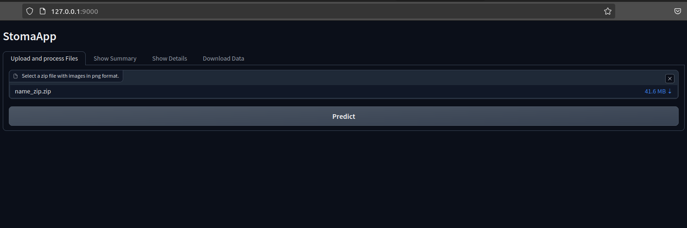
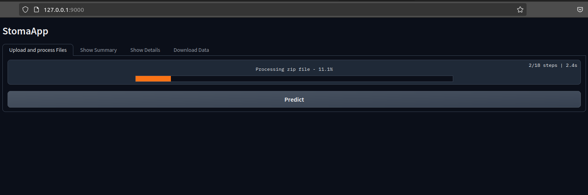
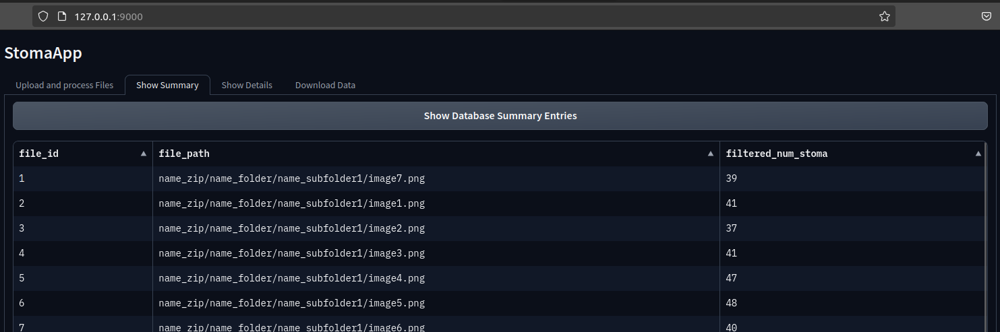
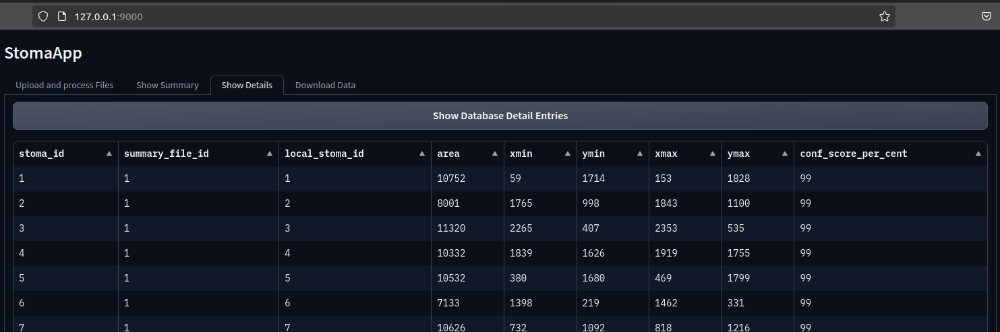
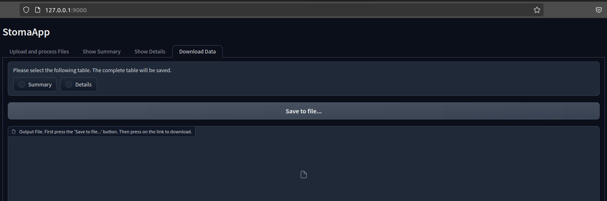

# StomaApp
An easy-to-use interface for counting stomata in microscopy images of maize leaves using [gradio](https://www.gradio.app/). 
## Overview
<p align="center">
    
</p>
StomaApp consists of 4 tabs. In the first one, the user is asked to upload files. Currently, the app accepts zip files with the following format:

- name_zip.zip
  - name_folder
    - name_subfolder1
      - image1.png
      - image2.png
      - ...
    - name_subfolder2
      - image3.png
      - image4.png
      - ...

The individual images should be in png format (either gray-scale or RGB).

By pressing the "Predict" button, the app will process every image in the zip file using the model called `stoma_detector.pth` in the `StomaApp/models` directory. A progress bar also shows the percentage of currently processed images. The uploaded zip file will be saved in `StomaApp/data/zips`.
<p align="center">
    
</p>

In the background, the model's predictions are saved into a mySQL database (`StomaApp/data/stoma.db`) and can be viewed in the next two tabs:
The tab `Show Summary` will show a database table, where one row holds the information of all counted and filtered stomata in one image.
<p align="center">
    
</p>

The tab `Show Details` will show a database table, where each predicted stoma is saved as one row. This is used to better understand the model's predictions and error sources.
<p align="center">
    
</p>

Finally, the last tab lets the user download the Summary and Detail tables as csv file.
<p align="center">
    
</p>

## Usage
1. Clone this project
```
git clone git@github.com:grimmlab/StomaDet.git
```
2. Adjust the Dockerfile in `StomaDet/StomaApp`, so the user matches your name and id.

3. Install StomaApp
```
cd StomaDet/StomaApp
docker build -t stoma_app .
```
4. Download trained model from Mendeley Data (TODO: add link) and paste the unzipped model in `StomaDet/StomaApp/models`.

## Start the app
```
docker run -it -v /path/to/github/repo/StomaDet/StomaApp/:/workspace -p 9000:9000 --workdir /workspace --runtime nvidia --gpus device=0 --name stoma_app stoma_app
python3 app.py
# to start the app with an empty database, use:
python3 app.py --delete_db True
```
The StomaApp webserver will be accessible through docker via port 9000 (usually 127.0.0.1:9000).

